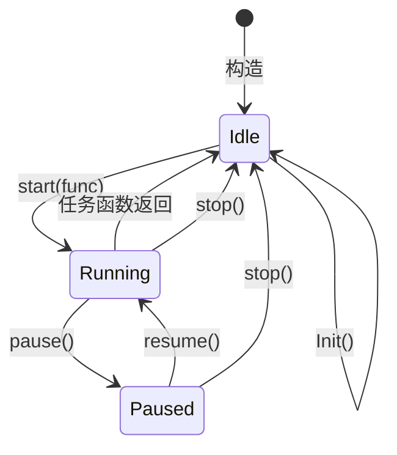
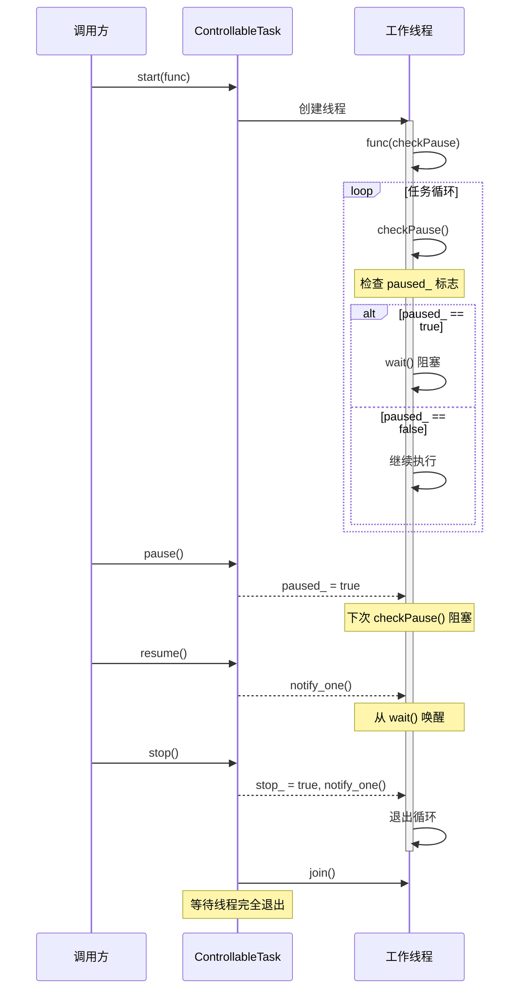
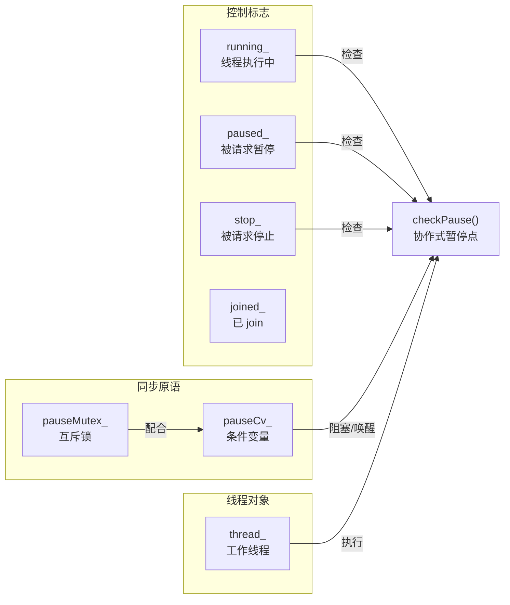

# ControllableTask 类图

```mermaid
classDiagram
    class ControllableTask {
        - thread_ : std::thread
        - running_ : atomic~bool~
        - paused_ : atomic~bool~
        - joined_ : atomic~bool~
        - stop_ : atomic~bool~
        - pauseMutex_ : std::mutex
        - pauseCv_ : condition_variable

        + ControllableTask()
        + ~ControllableTask()
        + start(func : TaskFunc) void
        + pause() void
        + resume() void
        + stop() void
        + Init() void
        - selfStop() void
        + isRunning() bool
        + isPaused() bool
        + isJoined() bool
        + isStoped() bool
    }

    class TaskFunc {
        <<function>>
        +operator()(checkPause : function~void()~) void
    }

    ControllableTask ..> TaskFunc : 持有
    ControllableTask ..> "1" std::thread : 管理
    ControllableTask ..> "1" std::mutex : 同步
    ControllableTask ..> "1" std::condition_variable : 等待/唤醒
```

## 状态转换图



## 线程控制流程



## 成员变量职责


