# C++ 学习笔记

## 目录
1. [简介](#简介)
2. [基础语法](#基础语法)
3. [面向对象编程](#面向对象编程)
4. [STL 标准模板库](#stl-标准模板库)
5. [高级特性](#高级特性)
6. [实践案例](#实践案例)
7. [参考资料](#参考资料)

---

## 一. 简介

---

## 二. C++基础

### 2.1 输入输出

#### 输出运算符 `<<`

输出运算符 `<<` 用于将数据输出到标准输出流（如 `std::cout`）。以下是一个简单的示例：

```cpp
#include <iostream>
using namespace std;

int main() {
    int a = 10;
    cout << "The value of a is: " << a << endl;
    return 0;
}
```

在上述代码中，`<<` 将字符串和变量的值依次输出到控制台。

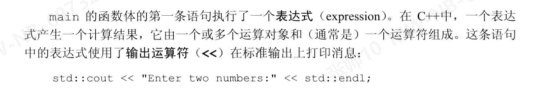

---

#### 输入运算符 `>>`

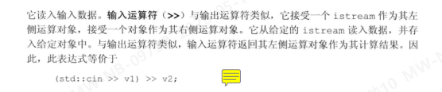

---

### 2.2 作用域运算符 `::`

作用域运算符 `::` 用于访问类或命名空间中的成员。

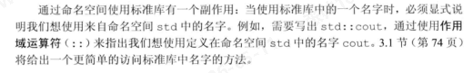

---
### 2.3 类简介class
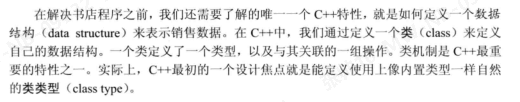
| 成员函数
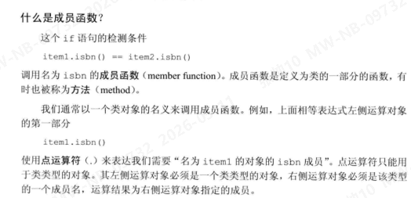

### 2.4 算术类型
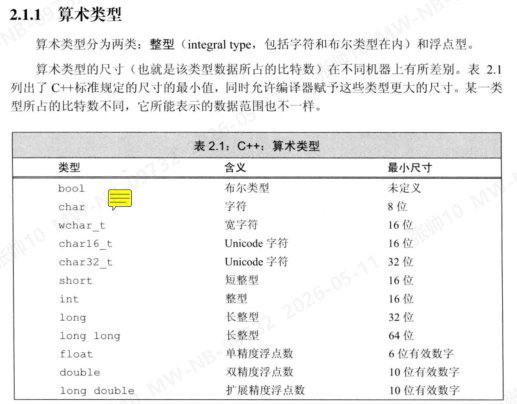

| 类型转换注意事项
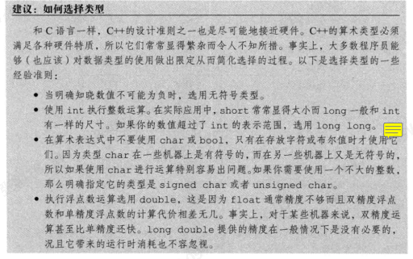
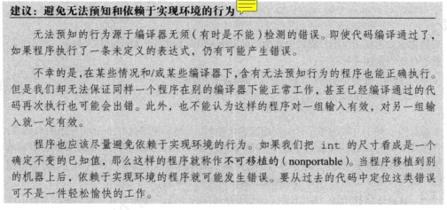
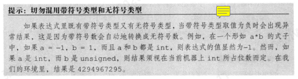
| 转义字符
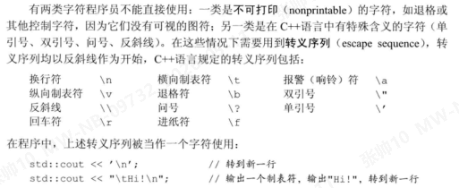
| 指定字面值的类型
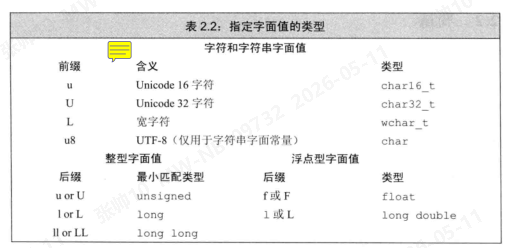
| 对象初始化
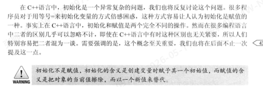
| 列表初始化 👌
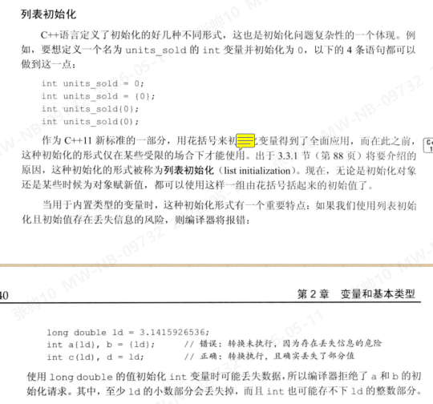
!默认初始化
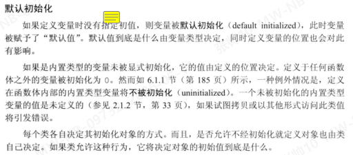
| 变量的声明和定义
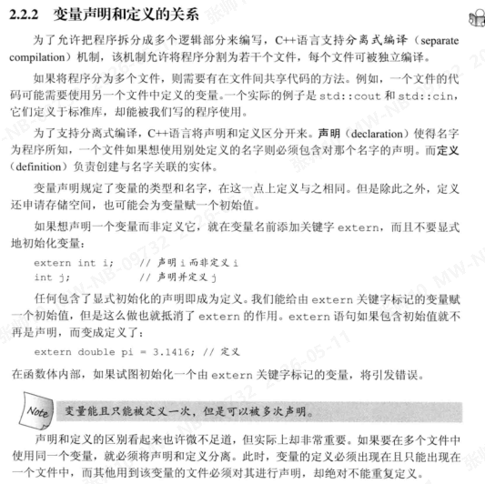
### 2.5 命名规范
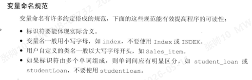

| 显示的访问全局作用域
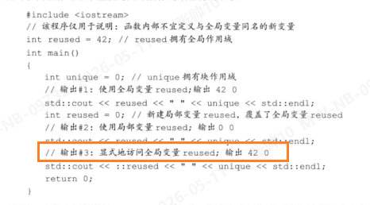

### 2.6 复合类型
| 引用
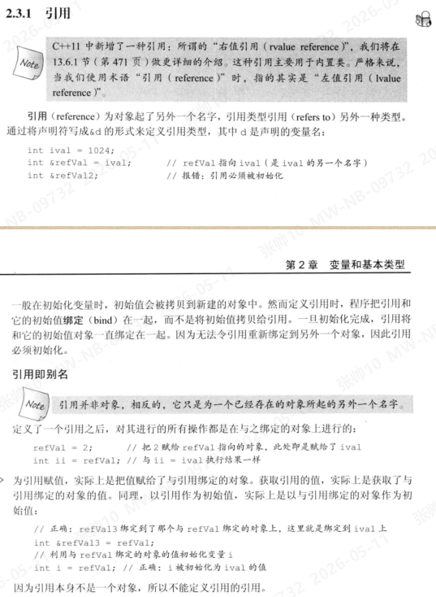
| 指针
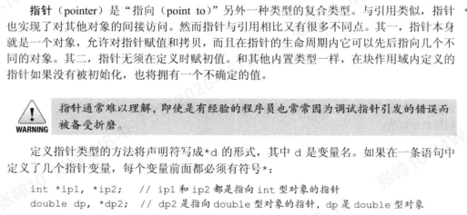
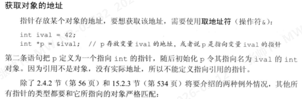
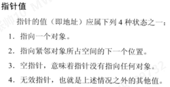
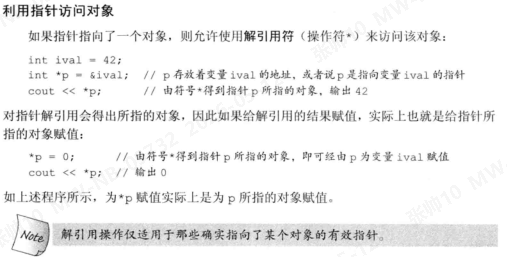
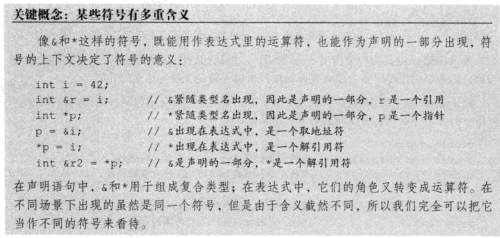
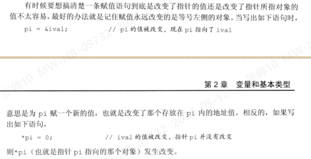
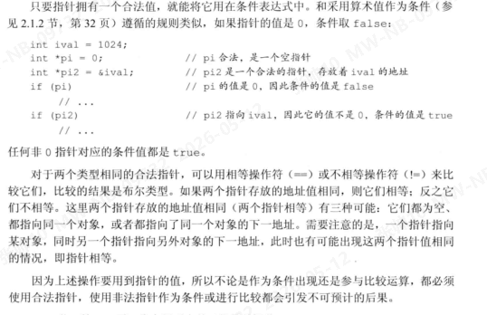
|void* 指针
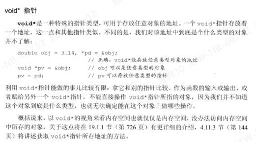
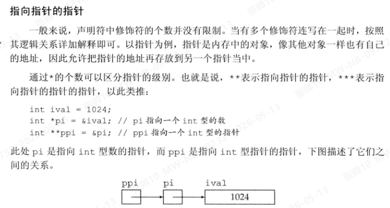

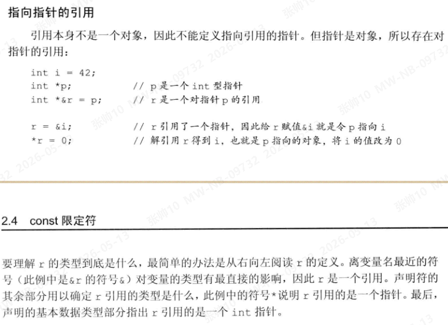

### 2.7 Cosnt
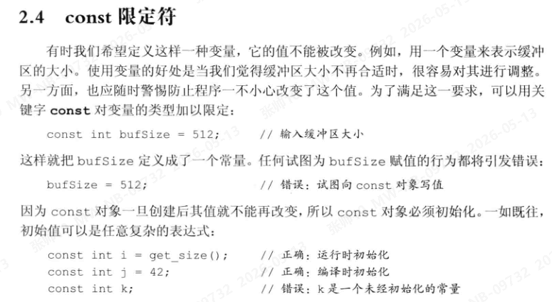
## 三. 面向对象编程

---

## 四. STL 标准模板库

---

## 五. 高级特性

---

## 六. 实践案例

---

## 七. 参考资料

---
